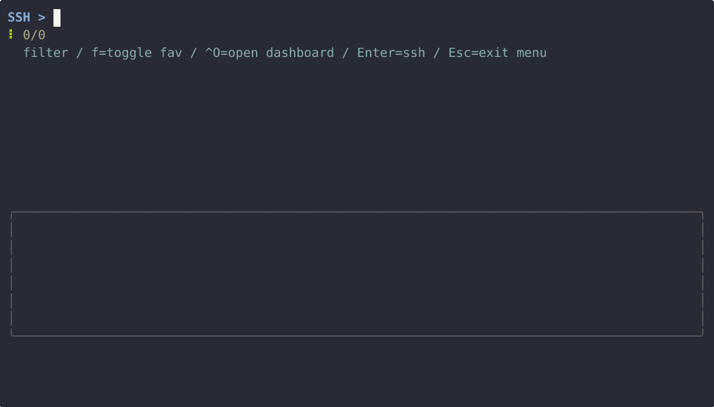
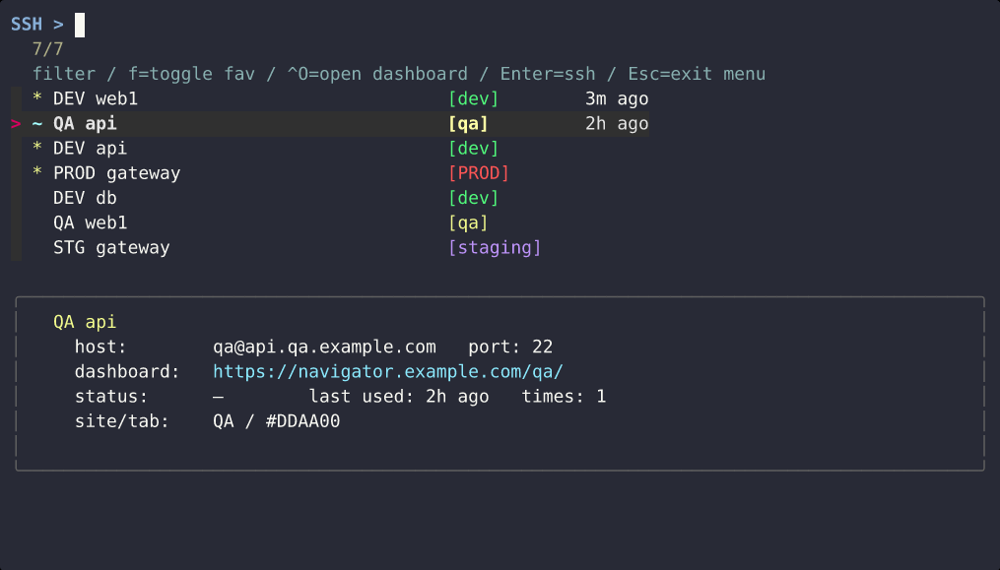
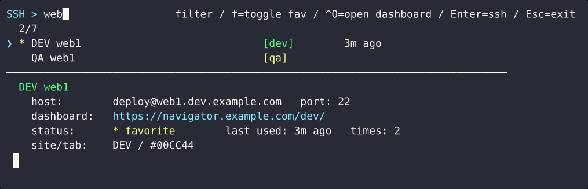
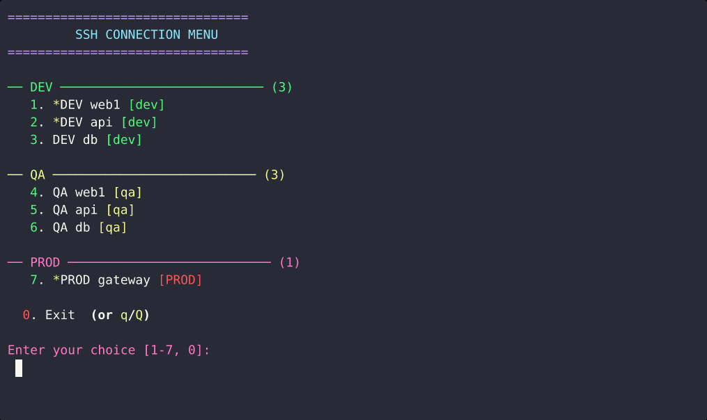
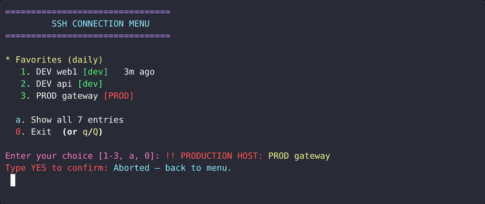
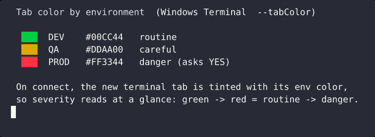

# ssh_menu

Tired of hunting down the right hostname or IP across spreadsheets, wiki
pages, sticky notes, and a sprawling `~/.ssh/config` every time you need to
connect? **`ssh_menu` puts every box you use in one fast, searchable menu.**
Fuzzy-search by name, your favorites and most-recently-used hosts float to the
top, and a single keypress connects — on WSL, in its own color-coded Windows
Terminal tab. One bash script, one plain text file, no daemon.

> 💡 **Best experience: Windows + WSL with [Windows Terminal](https://aka.ms/terminal).**
> That combo unlocks the headline feature — every connection opens in its **own
> tab, color-coded by environment** (dev 🟢 → qa 🟡 → staging 🔵 → prod 🔴) via
> `wt.exe --tabColor`, so you can tell at a glance which environment each tab is
> on. `ssh_menu` runs fine on plain Linux/macOS too (fuzzy menu, favorites,
> recency, preview, prod guard) — you just don't get the colored tabs, since
> that depends on Windows Terminal.



*Real recording in WSL: arrow through hosts (the preview pane follows each
one), press `f` to star a host live, then type to filter. Connecting opens a
color-coded Windows Terminal tab — that tab bar is a Windows GUI element, so
it isn't in the recording, but you'll see it the moment you connect.*

### Features at a glance

| Feature | |
|---|---|
| **Fuzzy menu + arrow nav** — favorites (`*`), recently used (`~`), colored env tags, "time ago"; move with `↑`/`↓` and the live preview pane follows the highlighted host. |  |
| **Type to filter** — the list narrows instantly and the preview follows the highlight. |  |
| **No-`fzf` fallback** — a clean numbered menu grouped by site, no extra tools required. |  |
| **Production guard** — any `PROD` host makes you type `YES` before it connects. |  |
| **Color-coded tabs** — on WSL, connecting opens a Windows Terminal tab tinted by environment (via `wt --tabColor`), so severity reads at a glance. These are the actual colors the tool assigns: |  |

> Shots 1–2 are real `fzf` frames captured in WSL; shots 3–4 are real output
> of the script's numeric mode. All use the bundled, fully-fake
> [`ssh_menu.conf.example`](ssh_menu.conf.example) — no real hosts. To get the
> same fuzzy UI, install **`fzf`** and run `./install.sh` (it seeds
> `~/.ssh_menu.conf` from the example), then `ssh_menu`. Without `fzf` you get
> the numbered menu in shot 3. See [Requirements](#requirements) for the
> one-line install per platform.
>
> On WSL, connecting opens a Windows Terminal tab color-coded by environment
> (dev green → qa amber → staging blue → prod red). That tab bar is a Windows
> GUI element, so it isn't shown here — but you'll see it the moment you
> connect.

---

## Why

`~/.ssh/config` is great for *defining* hosts but does nothing for *picking*
one fast when you have dozens. `ssh_menu` is the picker:

- **Fuzzy search** every host with [`fzf`](https://github.com/junegunn/fzf) —
  type a few letters, hit Enter, you're connected.
- **Recency-aware** — the 5 hosts you used most recently sort to the top,
  each annotated with `3m ago` / `2h ago` / `4d ago`.
- **Favorites** — star the hosts you hit daily; toggle a star live with `f`.
- **Live preview pane** — highlight a host to see its user/port, dashboard
  URL, favorite status, last-used time, and total connect count.
- **Colored terminal tabs** — on WSL, each environment opens in a Windows
  Terminal tab tinted by site so the color signals severity at a glance
  (dev green → qa amber → staging blue → prod red).
- **Open a dashboard** for the highlighted host with `Ctrl-O`.
- **Production guard** — any `PROD` host makes you type `YES` before it
  connects.
- **Graceful fallback** — no `fzf`? You get a clean numbered menu grouped by
  site instead. Nothing else is required.

---

## Requirements

| Tool | Purpose | Required? |
|------|---------|-----------|
| `bash`, `ssh`, coreutils (`sed`, `sort`, `cut`, `mktemp`, `date`) | core | **Required** (present on virtually every system) |
| [`fzf`](https://github.com/junegunn/fzf) | the fuzzy UI + preview pane | **Optional but recommended** — falls back to a numeric menu without it |
| `wt.exe` ([Windows Terminal](https://aka.ms/terminal)) | the per-environment **colored connection tabs** | **Strongly recommended on WSL** — this is what enables the colored tabs |
| `wslview` / `explorer.exe` / `xdg-open` | the `Ctrl-O` "open dashboard" action | Optional |

Install `fzf`:

```bash
sudo apt-get install fzf     # Debian / Ubuntu
sudo dnf install fzf         # Fedora / RHEL
brew install fzf             # macOS
sudo pacman -S fzf           # Arch
```

---

## Install

```bash
git clone https://github.com/ShawnLi42/ssh-menu.git
cd ssh-menu
./install.sh
```

`install.sh` will:

1. Symlink `ssh_menu.sh` to `~/.local/bin/ssh_menu` (override with `BIN_DIR=`).
2. Seed `~/.ssh_menu.conf` from the example **only if you don't already have one**.
3. Check dependencies and offer to install `fzf` if it's missing (it asks
   before running anything with `sudo`).

Then run:

```bash
ssh_menu
```

Prefer no installer? Just `chmod +x ssh_menu.sh`, drop it on your `PATH`, and
copy `ssh_menu.conf.example` to `~/.ssh_menu.conf`.

---

## Let your AI agent set it up

Using **Claude Code**, **Codex**, **Cursor**, or any other terminal AI agent?
Don't do it by hand — just ask. Paste a prompt like:

> Install ssh_menu from https://github.com/ShawnLi42/ssh-menu: clone it, run
> `install.sh`, and make sure `fzf` is installed. Then build my
> `~/.ssh_menu.conf` — group hosts by environment (DEV/QA/STG/PROD), star the
> ones I use daily, and use the right `user@host:port` for each. If I'm on WSL,
> confirm `wt.exe` is available so I get the colored tabs.

A capable agent can do the whole thing end to end:

- clone the repo and run `install.sh` (symlink + dependency check),
- install `fzf` for your platform,
- **generate `~/.ssh_menu.conf`** grouped and starred,
- adapt the site names, tag colors, tab colors, and dashboard URLs in
  `ssh_menu.sh` to match *your* environments (the `case` statements in
  `get_env_tag` / `site_color_for` / `tab_color_for` / `navigator_url_for`),
- on WSL, verify Windows Terminal (`wt.exe`) is on `PATH` for the colored tabs.

### No `~/.ssh/config`? No problem

The config is just a flat text file, so the agent can build it from whatever
you *do* have — tell it which applies:

- **Paste a list** of hosts/IPs (or a spreadsheet/CSV) right into the chat.
- **Your shell history** — `grep -hE '\bssh ' ~/.bash_history ~/.zsh_history`
  surfaces the boxes you actually connect to; the agent can dedupe those.
- **`~/.ssh/known_hosts`** — the hosts you've connected to before.
- **Your cloud inventory** — e.g. `aws ec2 describe-instances`,
  `gcloud compute instances list`, `kubectl get nodes -o wide`, or a Terraform
  state — the agent can turn the output into entries.
- **Just dictate them** — "I've got web1/web2 in dev, an api box in qa, and a
  prod gateway on port 2222" is enough for it to write the file.

Everything it needs is in this repo and [Configuration](#configuration) below —
the script is a single readable bash file, so the agent can tailor it safely.

> ⚠️ Your `~/.ssh_menu.conf` holds real hostnames/IPs — keep it local. It's
> already in `.gitignore`; never commit it or paste it into a public place.

---

## Configuration

One connection per line in `~/.ssh_menu.conf`:

```
[* ]Name:user@host:port
```

- The **first word of `Name`** is the *site* (e.g. `DEV`, `QA`, `STG`, `PROD`)
  and drives the colored tag, group color, tab color, and dashboard URL.
- A leading **`* `** marks the entry a **favorite**.
- Lines starting with `#` and blank lines are ignored.

```ini
* DEV web1:deploy@web1.dev.example.com:22
DEV db:deploy@db.dev.example.com:22
QA api:qa@api.qa.example.com:22
* PROD gateway:ops@gateway.prod.example.com:2222
```

### Adapting it to your environments

The site names, colors, dashboard URLs, and which sites get a colored tab are
plain `case` statements near the top of `ssh_menu.sh`:

| Function | Controls |
|----------|----------|
| `get_env_tag` | the `[dev]` / `[qa]` / `[staging]` / `[PROD]` tag + color |
| `site_color_for` | the group header color in the numeric menu |
| `tab_color_for` | the Windows Terminal tab color (and whether a tab opens at all) |
| `navigator_url_for` | the dashboard URL opened with `Ctrl-O` |

Edit those to match your own naming. The `PROD` confirmation guard is in the
main loop (`case "$name" in "PROD"*) ...`).

### Environment overrides

| Variable | Default | Meaning |
|----------|---------|---------|
| `SSH_MENU_CONF` | `~/.ssh_menu.conf` | config file path |
| `SSH_MENU_HISTORY` | `~/.ssh_menu.history` | connect-history path |
| `WT_PROFILE_ID` | *(unset)* | Windows Terminal profile to open tabs with |

---

## Keys (fzf mode)

| Key | Action |
|-----|--------|
| type | fuzzy-filter the list |
| `↑` / `↓` | move |
| `Enter` | connect |
| `f` | toggle favorite (rewrites the config and reloads) |
| `Ctrl-O` | open the highlighted host's dashboard URL |
| `Esc` | exit the menu |

Markers in the list: `*` (yellow) favorite · `~` (cyan) recently used · blank
otherwise. The menu loops after each connection so you can fan out several
sessions back-to-back; `Esc` leaves.

---

## How it works

- **Connections** live in `~/.ssh_menu.conf`; **history** is appended to
  `~/.ssh_menu.history` as `<unix_ts>|<name>` lines, one per connect. Recency
  and "times used" are derived from that file.
- In fzf mode the script **dispatches back into itself** via hidden flags
  (`--gen-lines`, `--preview-line`, `--toggle-fav`, `--open-nav`) so fzf's
  key-binds and preview window can call the same code that renders the menu.
- Neither file is committed — both are in `.gitignore` — so your real hosts
  never end up in version control.

---

## License

[MIT](LICENSE) © 2026 Shawn Li
